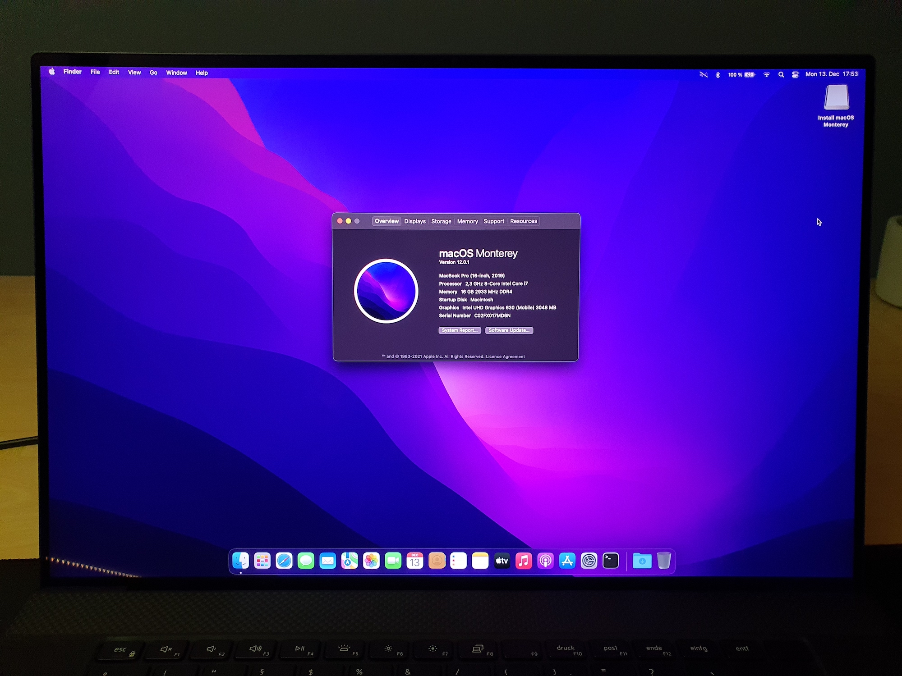
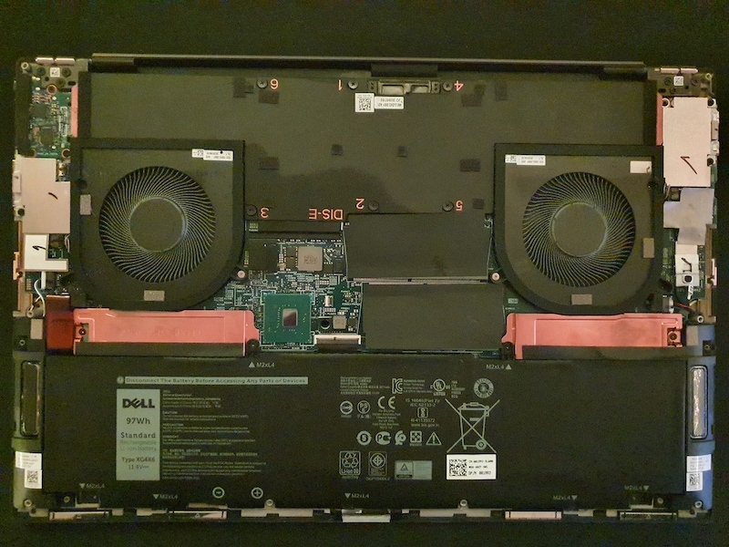
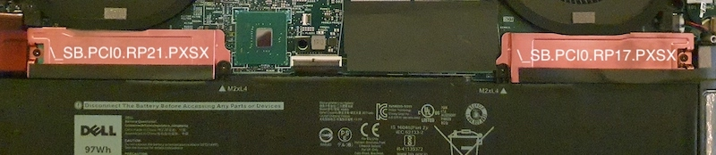

# XPS9700_HACK



✅ This configuration is fully compatible with `macOS BigSur` **and** `macOS Monterey`!

😔 One of the most awesome features of this laptop doesn't **yet** work: audio. If you want to help, contact me!

My main goal for this "guide" is to provide a smooth installation experience with no indefinite steps, which is why I've documented everything to a pretty high extent. You *can* skip through and probably be just fine, but I'd still advise you to take your time!

## Table of Contents

* [Hardware](#hardware)
  * [Current State](#current-state)
* [BIOS](#bios)
* [Deactivating unsupported NVMe](#deactivating-unsupported-nvme)
* [Undervolting Preliminary Work](#undervolting-preliminary-work)
* [Installation](#installation)
* [Post\-Installation](#post-installation)
  * [WiFi](#wifi)
  * [System Preferences](#system-preferences)
  * [Hackintool](#hackintool)
  * [VoltageShift](#voltageshift)
  * [CPUFriendFriend](#cpufriendfriend)
  * [Re\-paste and Re\-pad](#re-paste-and-re-pad)

## Hardware

As far as I know, all XPS 9700 4K machines will ship with the exact same hardware, other than RAM and SSD. RAM is pretty much irrelevant in our case, but if you got an *SK Hynix* as your SSD, it needs to go. Actually, I've kept mine, and installed a compatible drive in the second available M.2 slot. This is efficient, but comes with one small caveat: The Hynix slot **needs** to be "disabled" with a custom SSDT in order for macOS not to loose it's mind on boot. More on that later!



### Current State

After adding custom bought parts, this is what I'm running on (check against yours, or your mileage may vary):

| Part | Description | Working on macOS | Comment |
| ---- | ----------- | ---------------- | ------- |
| **Working** |
| Intel Core i7-10875H | 8C/16T CometLake Processor, UHD-630 | yes, fully | / |
| Display | Dell XPS 17 SHP14D6 4K 16:10 | yes, fully | / |
| Kingston Fury DDR4-2933 2x16GB | 32GB of CL17-19-19 | yes, fully | 2933MHz is max |
| WD Black SN750 1TB | M.2 Gen3 SSD, Slot B | yes, fully | / |
| Killer AX1650s | WiFi 6 & BT 5 Card | yes, pretty good | soldered in |
| Touchpad | DELL098F:0004F3:311C, I2C | yes, fully | all gestures operational |
| Keyboard | Standard PS2 | yes, fully | function keys are mapped |
| Touch-Digitizer | ELAN2097:0004F3:2A15, I2C | yes, fully | all native gestures operational |
| SD-Card reader | Realtek RTS5260 | yes, with most cards | / |
| Webcam | Micromedia 0c45:6d14, 0.9MP | yes, fully | / |
| Battery | DELL 01RR3YM Li-poly 95.1Wh | yes, fully | / |
| **Untested** |
| Gigabit Ethernet | Realtek RTL8153 | not yet tested | / |
| Thunderbolt 3 | Intel JHL7540, JHL6540 | not yet tested | / |
| USB-C Video 4K@60Hz | / | not yet tested | / |
| Sensors | Intel 8086:06fc:1028:098f 400 Series Sensor Hub | not yet tested | / |
| **Currently Not Working** |
| Speakers & Jack | Codec currently unknown, it's tough | no | / |
| Ambient Light Sensor | Would be nice, haven't yet worked on it | no | / |
| **Dead forever** |
| SK Hynix PC611 1TB | M.2 Gen3 SSD, Slot A | no | deactivated using SSDT |
| Nvidia RTX 2060 Max-Q | 6GB DDR6 VRAM | no | deactivated using SSDT |
| Fingerprint reader | Shenzhen Goodix 27c6:533c | no | / |

## BIOS

I am on the currently (date: 11th Dec, 2021) latest available BIOS, which I installed using windows updates. It then flashed the firmware onto my device on a reboot. The exact version is: 1.11.1 11/18/2021. In order to have no complications, make sure you change these BIOS settings:

| Menu | Setting | State |
| ---- | ------- | ----- |
| Boot Configuration | Enable Secure Boot | Off |
| Integrated Devices | Thunderbolt Security Level | No Security |
| Storage | Sata Operation | AHCI |
| Power | Enable Lid Switch | On |
| Security | Intel Software Guard Extensions | Software Control |
| Power | Block Sleep | On |

Blocking sleep is just a bypass for now, I hope there's a fix down the road. I'll keep an eye on the topic.

## Deactivating unsupported NVMe

If you also want to use an unsupported NVMe drive in the second slot, you need to disable it for macOS. When looking at the opened up machine having the battery at the bottom (and thus the labels on it readable), the *left* slot is at `\_SB.PCI0.RP21.PXSX` and the *right* slot is at `\_SB.PCI0.RP17.PXSX`. You can always check your paths in Windows' Device Manger, at Storage controllers > NVM Express Controller > Details > BIOS device name. Then, just adapt the paths in `SSDT-NVMe-SLT.aml` under `ACPI`, and enable it in `config.plist`.



## Undervolting Preliminary Work

In order to undervolt this machine, you need to change the value of two memory addresses. When performed properly, this is totally safe. Just triple-check what you've typed, as writing to wrong addresses can really ruin your whole day. To start, activate the two tools `VerifyMsrE2.efi` and `modGRUBShell.efi` in `config.plist`'s Tools section, then boot and run `modGRUBShell.efi`. This will open up a GRUB shell, in which you execute the following commands:

```
setup_var CpuSetup 0xDA 0x0
setup_var CpuSetup 0x3E 0x0
exit
```

After executing `exit`, you're back in the picker. In order to apply this tho, you need to restart, hit F2, go into BIOS and do a factory reset, then reboot again. After all of this, check that `VerifyMsrE2.efi` prints a success message. If it does, you're good to go using something like ThrottleStop on Windows and VoltageShift on macOS.

If you experience any crashes, you can try limiting your max turbo to `4200MHz`. This made things stable on my machine, even at a CPU offset of -140mV. Higher clock speeds are not really going to help you anyways, as they would only be very short-term.

## Installation

Please use `EFI-PREINST` for the installation-process. Because I want to have WiFi available during install, I am loading `AirportItlwm`, and not `itlwm`, which would require `HeliPort`. This provides a better installation experience.

When booting into the installer, please bring some patience with you! The Monterey installer boots even a bit slower than BigSur, but both speeds don't matter, as this is a one time thing. I can assure you that both operating-systems boot up pretty quickly! There can be many reboots until you're greeted with the setup screen, that's completely normal.

Other than that, there's not much you need to be aware of. Maybe keep your device plugged in during installation, to avoid disk corruption due to a dead battery. I formatted my SN750 as an `APFS` drive called "Macintosh", then just installed onto that.

## Post-Installation

From now on, please use `EFI-POSTINST`. Since this should be your true EFI, I cleared the PlatformInfo > Generic fields, so you need to fill them up with custom generated values.

Download [gensmbios](https://github.com/corpnewt/GenSMBIOS), execute it, and generate for an `MacBookPro16,1`. Then, fill in the following values:

* MLB
* ROM
* SystemSerialNumber
* SystemUUID

### WiFi

As `AirportItlwm` is by far not as stable as `itlwm`, and `HeliPort` has gotten pretty good, I think that it just makes sense to switch from now on. Download `HeliPort` beforehand, swap the EFI and reboot. Then, add `HeliPort` to your login-items.

### System Preferences

To have a proper trackpad-experience, go to the Trackpad pane, then change:

* Point & Click
  * Look up & data detectors - OFF
  * Secondary click - ON (choose your preferred gesture from dropdown)
  * Tap to click - ON
  * Silent clicking - OFF (not supported)
  * Force Click and haptic feedback - OFF (not supported)
  * Tracking speed - I personally like to bump that up a bit
* More Gestures 
  * Notification Centre - OFF (this gesture seems buggy)

The following changes are optional, but I think they'll improve the over all experience:

* Dock & Menu Bar
  * WiFi
    * Show in Menu Bar - OFF (because of HeliPort)
  * Bluetooth
    * Show in Menu Bar - ON
  * Sound
    * Show in Menu Bar - always
  * Battery
    * Show in Menu Bar - ON
    * Show Percentage - ON
* Accessibility
  * Zoom
    * Use scroll gesture with modifier keys to zoom - ON
* Software Update
  * Advanced
    * Check for updates - OFF (you always should update manually!)

* Open Finder
  * Press CMD + ,
    * General - Hard disks - ON (show all disks)

### Hackintool

Quickly download and launch hackintool, then go to the "Power" tab and click the screwdriver icon in order to change the power-management variables to hackintosh-sane values.

### VoltageShift

⚠️️ Make sure you've read and applied the undervolting preliminary work section first!

`VoltageShift.kext` is within OpenCore's Kext folder and get's injected during boot. I generally don't recommend fiddling around with `/Library/Extensions` or `/System/Library/Extensions`. In an ideal case, the macOS disk would look just like a vanilla mac's, and all stuff hackintosh-related get's isolated into /EFI. As of now, voltageshift doesn't support boot arguments, and thus needs to still build it's launch daemon into `/Library/LaunchDaemons/com.sicreative.VoltageShift.plist`, which is a init-script that launches the executable that get's copied into `/Library/Application\ Support/VoltageShift/`. Yes, it's far from ideal, but it's what we have to work with... Luckily, all of this is managed under the hood by the `voltageshift` executable. Download it [here](https://github.com/sicreative/VoltageShift/blob/master/voltageshift_1.25.zip), then I suggest to create a tools folder within Documents, where you can store and leave this tool.

These values are pretty safe and stable, you need to try yourself if you can push it further:

```
CPU Core: -130mV
iGPU: -75mV
Cache: -90mV
Turbo: ON
PL1: 90W
PL2: 45W
```

Applying them like this:

```bash
sudo ./voltageshift buildlaunchd -130 -75 -90 0 0 0 1 90 45 -1
```

Afterwards, just reboot and check with `./voltageshift into` if your work has been applied.

### CPUFriendFriend

I'd like you to generate your own CPU power management data provider, since your setup may vary from mine. The python script makes it incredibly easy, it just requires two keypresses.

Download [CPUFriendFriend](https://github.com/corpnewt/CPUFriendFriend), which contains `CPUFriendFriend.py`. 

Then, call `./CPUFriendFriend.command` and follow these steps:

* Choose 800MHz by typing 0x08
* Choose Balanced Power by typing 0x80
* Choose the default by typing 0x05
* Choose no, since we have enough power saving by now
* Building...

After generating, replace the one I created in `EFI/OC/Kexts`, just to be safe that it really does match your machine's CPU. This will help keeping the clock frequency down on light tasks, and thus save battery.

### Re-paste and Re-pad

The stock thermal paste and pads are (in my humble opinion) very poor, and swapping them out for better stuff will yield better temps, don't underestimate this! It's not that hard to disassemble the vapor-chamber, if you managed to open the laptop up in the first place, this'll be a piece of cake!

// TODO: Write instructions on how to accomplish this once the parts arrive